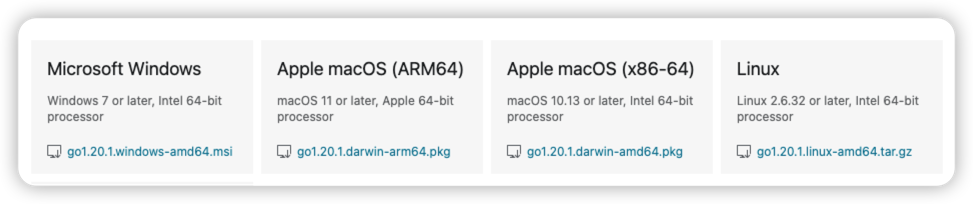

---

# Go快速入门（一）

### 环境准备

Go语言支持以下系统

- Linux

- FreeBSD

- Mac OS X（也称Darwin）

- Windows

安装包下载地址：https://go.dev/dl/

国内备用下载地址：https://golang.google.cn/dl/

下载和安装官网参考地址：[Download and install - The Go Programming Language](https://go.dev/doc/install)

各个系统对应的文件名称：



**Windows下安装**

- 打开你下载的MSI文件并按照提示安装Go
- 进入cmd窗口、输入下面命令确定是否安装成功

```shell
go version
```


**macOS下安装**

- **通过brew 安装**

```shell
brew install go
或者
brew install golang
```

- **官网下载pkg包来安装**

打开下载的pkg包文件，按照提示安装go即可

-  **验证**

```shell
\W $ go version
go version go1.20.1 darwin/amd64
\W $ 
```

**Linux下安装**

- 下载安装包，执行下面的命令

```shell
 rm -rf /usr/local/go && tar -C /usr/local -xzf go1.20.1.linux-amd64.tar.gz
```

- 将 /usr/local/go/bin 添加到`PATH`环境变量中

```shell
export PATH=$PATH:/usr/local/go/bin
```

- 通过source命令让配置生效

```shell
source /etc/profile
```

- 验证是否安装成功

```
 go version
```


**推荐开发工具**：[GoLand 工具下载](https://www.jetbrains.com/go/download/#section=mac)


### 开始一个Go程序：hello，world！

经典入门程序：

**步骤**：创建main.go文件，复制内容到文件内；执行go run main.go 命令即可

**示例**：

```go
package main

import "fmt"

func main() {
    fmt.Println("hello,world!")
}
```

```shell
\W $ go run main.go 
hello,world!
```

### 数据类型

数据类型

- 布尔型（bool）

  - true
  - false

- 数值类型

  - 整型
    - 无符号
      - uint
      - uint8
      - uint32
      - Uint64
    - 有符号
      - int
      - int8
      - int32
      - Int64
  - 浮点型
    - 单精度 float32
    - 双精度 float64

- 字符类型

  - byte   代表ASCII码的一个字符
  - rune   代表一个UTF-8字符

- 字符串类型（string）

- 派生类型

  - 指针类型 （Pointer）

  - 数组类型 （Array）

  - 切片类型（slice）

  - 结构体类型（struct）

  - Map类型 （Map）

  - 管道型类型（channel）

  - 函数类型（function）

  - 接口类型（interface）

    

### 变量和常量

> Go是静态类型语言，不能在运行期改变变量类型


**变量名规范：** 由字母、数字、下划线组成，其中首字母不能以数字开头。

**变量名命名建议：** 驼峰命名 （骆峰式命名法就是当变量名或函式名是由一个或多个单字连结在一起，而构成的唯一识别字时，第一个单词以小写字母开始；第二个单词的首字母大写或每一个单词的首字母都采用大写字母!    例如：variableOne、learnGo）


### 变量

**变量声明规则：** 

```go
var 变量名称 变量类型= 变量值   eg：	var name string ="Go"
或者
var 变量名称 = 变量值 （编译器会自动识别变量类型） eg: var name="Go"
或者
变量名称 := 变量值 （ := 只能在函数内部使用）eg:	name := "Go"
```

**多个变量如何声明：**每个单独声明或者使用var () 进行多个声明

```Go
var (
	变量名称 变量类型 = 变量值
	变量名称        = 变量值
)   eg：
var (
	name1 string = "Go"
	name2        = "Go1"
)
或者
变量名称a，变量名称b := 变量值a,变量值b （函数内） eg name1,name2 := "Go","GO1"
```


### 常量 和 iota

**常量定义：** 常量使用关键字const定义，用于存储不会改变的数据

**常量声明规则：** 

> 常量数据类型：只可以是布尔型、数字型（整数型、浮点型和复数）和字符串类型
>
> 值：必须是能够在编译时就能确定

```go
const 常量名称 常量数据类型 = 值  eg： const name string = "GO"
或者
const 常量名称 = 值 eg： const name ="GO" 
```

**多个常量声明规则：** 每个单独声明或者使用const() 进行多个声明

```go
const (
	常量名称1 常量数据类型 = 常量值
	常量名称2
	常量名称3
	常量名称4 常量数据类型 = 常量值
)
eg
const (
	a int = 3
	b
	c
	d string = "aa"
  e
)
运行后
```

**注：** 如果是批量声明的常量，除了第一个外其它的常量右边的初始化表达式都可以省略，如果省略初始化
表达式则表示使用前面常量的初始化表达式写法

```go
const (
	a int = 3
	b
	c
	d string = "aa"
	e
)
result: 3,3,3,aa,aa
```

### iota 常量生成器

```go
package main

import "fmt"

const (
	a int = iota
	b
	c
)

func main() {

	fmt.Printf("%v,%v,%v", a, b, c)
}
result: a=0,b=1,c=2
```

**总结：** 在一个const声明语句中，在第一个声明的常量所在的行，iota将会被置为 0，然后在每一个有常量声明的行加一


### 变量作用域


#### 局部变量

**定义：**  在函数体内声明的变量

**作用域：**  只在函数体内，参数和返回值也是局部变量


#### 全局变量

**定义：** 在函数外声明的变量

**作用域：** 全局的，可以在整个包甚至外部包（被导出后）使用。包的概念后面介绍

#### 注意

> 无论全局变量还是局部变量, 只要作用域相同都不能出现同名的变量
>
> **建议声明的每个变量不要重复，这样会避免很多意想不到的问题发生**

局部变量名和全局变量名相同的话，函数内的局部变量会优先考虑

```go
package main

import (
	"fmt"
)

/* 声明全局变量 */
var g int = 20

func main() {
	/* 声明局部变量 */
	// var g int = 10 //编译报错
	// var g int = 11 // 编译报错
	var g int = 10
	fmt.Printf("%v", g) // 10 
}

```

对于多变量声明（简式 :=)，而且其中至少有一个新的声明变量,则允许变量重复

```go
package main

import (
	"fmt"
)

/* 声明全局变量 */
var g int = 20

func main() {
	/* 声明局部变量 */
	// var g int = 10 //编译报错
	// var g int = 11 // 编译报错
	var g int = 10
	g, s := getData()
	fmt.Printf("g=%v,s=%v", g, s) // g=2,s=hh
}

func getData() (int, string) {
	fmt.Println(g) // 20
	return 2, "hh"
}

```

#### 变量的默认值

Go语言中无论是全局变量还是局部变量,只要定义了一个变量都有默认的0值

- int/int8/int16/int32/int64/uint/uint8/uint16/uint32/uint64/byte/rune/uintptr的默认值是0
- float32/float64的默认值是0.0
- bool的默认值是false
- string的默认值是""
- pointer/function/interface/slice/channel/map/error的默认值是nil
- 其它复合类型array/struct默认值是内部数据类型的默认值

```go
package main

import (
	"fmt"
)

func main() {
	var intV int                 // 整型变量
	var floatV float32           // 实型变量
	var boolV bool               // 布尔型变量
	var stringV string           // 字符串变量
	var pointerV *int            // 指针变量
	var funcV func(int, int) int // function变量
	var interfaceV interface{}   // 接口变量
	var sliceV []int             // 切片变量
	var channelV chan int        // channel变量
	var mapV map[string]string   // map变量
	var errorV error             // error变量

	fmt.Println("int = ", intV)             // 0
	fmt.Println("float = ", floatV)         // 0
	fmt.Println("bool = ", boolV)           // false
	fmt.Println("string = ", stringV)       // ""
	fmt.Println("pointer = ", pointerV)     // nil
	fmt.Println("func = ", funcV)           // nil
	fmt.Println("interface = ", interfaceV) // nil
	fmt.Println("slice = ", sliceV)         // []
	fmt.Println("slice = ", sliceV == nil)  // true
	fmt.Println("channel = ", channelV)     // nil
	fmt.Println("map = ", mapV)             // map[]
	fmt.Println("map = ", mapV == nil)      // true
	fmt.Println("error = ", errorV)         // nil

	var arraryV [3]int // 数组变量
	type Person struct {
		name string
		age  int
	}
	var structV Person // 结构体变量
	var structPrV *Person
	fmt.Println("arrary = ", arraryV)          // [0, 0, 0]
	fmt.Println("struct = ", structV)          // {"" 0}
	fmt.Println("struct pointer =", structPrV) // nil
}
```


### 类型转换

- **类型强转:**     var  变量名 变量类型 =  变量类型(原变量值) 

> 注意！！！ 精度丢失问题 ！！如 int64 转int32

```go
package main

import "fmt"

func main() {
	var int32v int32 = 12345
	int64v := int64(int32v)
	fmt.Println(int32v) // 12345
	fmt.Println(int64v) // 12345
	var int64V int64 = 123455678906555555
	int32V := int32(int64V)
	fmt.Println(int64V) // 123455678906555555
	fmt.Println(int32V) // 783998115 精度丢失
}

```

- **数值类型转字符串类型 ：** 关注strconv包

  - strconv.FormatXXXX ()方法去转换

  - fmt.Sprintf() 去转换

  ```go
  package main
  
  import (
  	"fmt"
  	"strconv"
  )
  
  func main() {
  	var int32v int32 = 12345
  	fmt.Println(strconv.FormatInt(int64(int32v), 10)) // 12345
  	fmt.Println(fmt.Sprintf("%d", int32v))            // 12345
  }
  ```

  

- **字符串类型转数值类型：**关注strconv 包

  - strconv.ParseXXXX() 方法去转换

  ```go
  package main
  
  import (
  	"fmt"
  	"strconv"
  )
  
  func main() {
  	v, _ := strconv.ParseInt("12345", 10, 32)
  	fmt.Println(v) // 12345
  }
  
  ```


### 运算符

Go语言内置运算符

- 算术运算符
- 关系运算符
- 逻辑运算符
- 位运算符
- 赋值运算符
- 其他运算符

本节只会介绍常见的算法运算符、关系运算符、逻辑运算符、赋值运算符

**算术运算符**

| 运算符 | 描述 | 示例 |
| ------ | ---- | ---- |
| +      | 相加 | A+B  |
| -      | 相减 | A-B  |
| *      | 相乘 | A*B  |
| /      | 相除 | A/B  |
| %      | 求余 | A%B  |
| ++     | 自增 | A++  |
| --     | 自减 | A--  |


**关系运算符**

| 运算符 | 描述                                                         | 示例   |
| ------ | ------------------------------------------------------------ | ------ |
| ==     | 检查两个值是否相等，如果相等返回 True 否则返回 False。       | A == B |
| !=     | 检查两个值是否不相等，如果不相等返回 True 否则返回 False。   | A != B |
| >      | 检查左边值是否大于右边值，如果是返回 True 否则返回 False。   | A >  B |
| <      | 检查左边值是否小于右边值，如果是返回 True 否则返回 False。   | A < B  |
| >=     | 检查左边值是否大于等于右边值，如果是返回 True 否则返回 False。 | A >= B |
| <=     | 检查左边值是否小于等于右边值，如果是返回 True 否则返回 False。 | A <= B |


**逻辑运算符**

| 运算符 | 描述                                                         | 示例   |
| ------ | ------------------------------------------------------------ | ------ |
| &&     | 逻辑 AND 运算符。 如果两边的操作数都是 True，则条件 True，否则为 False。 | A&&B   |
| \|\|   | 逻辑 OR 运算符。 如果两边的操作数有一个 True，则条件 True，否则为 False。 | A\|\|B |
| !      | 逻辑 NOT 运算符。 如果条件为 True，则逻辑 NOT 条件 False，否则为 True。 | !A     |


**赋值运算符**

| 运算符 | 描述                                           | 示例                    |
| ------ | ---------------------------------------------- | ----------------------- |
| =      | 简单的赋值运算符，将一个表达式的值赋给一个左值 | C=A+B                   |
| +=     | 相加后再赋值                                   | C+=A或C=C+A             |
| -=     | 相减后再赋值                                   | C -= A 等于 C = C - A   |
| *=     | 相乘后再赋值                                   | C *= A 等于 C = C * A   |
| /=     | 相除后再赋值                                   | C /= A 等于 C = C / A   |
| %=     | 求余后再赋值                                   | C %= A 等于 C = C % A   |
| <<=    | 左移后赋值                                     | C <<= 2 等于 C = C << 2 |
| \>>=   | 右移后赋值                                     | C >>= 2 等于 C = C >> 2 |
| &=     | 按位与后赋值                                   | C &= 2 等于 C = C & 2   |
| ^=     | 按位异或后赋值                                 | C ^= 2 等于 C = C ^ 2   |
| \|=    | 按位或后赋值                                   | C\|=2 等于C｜2          |


### 流程控制

#### 条件语句

- **if语句**

```go
if 条件表达式 {
   // 为true时执行语句
}
或
if 初始化语句;条件表达式{
  // 为true时执行语句
}
```

```go
package main

import "fmt"

func main() {
   b := 4
   if b > 2 {
      fmt.Println("if b ")
   } // 输出 if b
   if a := 3; a > 2 {
      fmt.Println("if a ")
   } // 输出 if a
}
```

- **if...else 语句**

```go
if 条件表达式 {
   // 为true时执行语句
}else{ // 否则执行

}
或
if 初始化语句;条件表达式{
  // 为true时执行语句
}else{

}
或
if 条件表达式{
  // 为true时执行语句
}else if 条件表达式 {

}else {
  
}
```

```go
package main

import "fmt"

func main() {
	if a := 3; a > 4 {
		fmt.Println("if a ")
	} else{
		fmt.Println("else a")
	}// 输出 else a
	b := 4
	if b > 5 {
		fmt.Println("if b ")
	} else{
		fmt.Println("else b")
	}// 输出 else b
}

```

