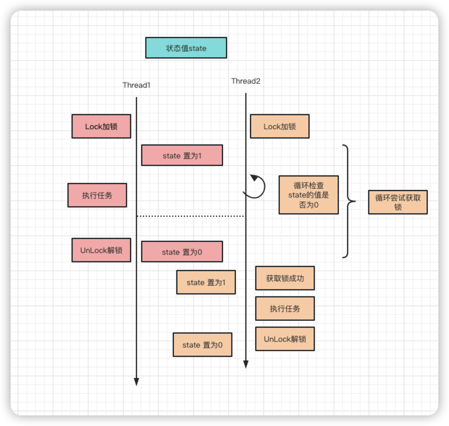

# 「动手实践系列之自旋锁设计」如何用Go优雅的实现高性能自旋锁

## 一、简介

 **维基百科介绍：** **自旋锁**是[计算机科学](https://zh.wikipedia.org/wiki/计算机科学)用于多线程[同步](https://zh.wikipedia.org/wiki/同步_(计算机科学))的一种[锁](https://zh.wikipedia.org/wiki/互斥锁)，线程反复检查锁变量是否可用。由于线程在这一过程中保持执行，因此是一种[忙等待](https://zh.wikipedia.org/wiki/忙等待)。一旦获取了自旋锁，线程会一直保持该锁，直至显式释放自旋锁。

通用点讲是指当一个线程在获取锁的时候，如果锁已经被其他线程获取，那么该线程将循环等待，然后不断的判断锁是否能够被成功获取，直到获取到锁才退出循环。

**自旋锁的示意图：**




## 二、自旋锁实现（Golang版本）

从自旋锁的定义和交互示意图可知，要想实现自旋锁初步需要关注四个地方：加锁、解锁、锁的状态值、循环尝试获取锁。

下面依据自旋锁的示意图来实现一版自旋锁：

### 加锁和解锁

对于Go语言来说，需要实现标准库提供的sync.Lock接口

**sync.Locker**

```go
// A Locker represents an object that can be locked and unlocked.
type Locker interface {
	Lock()
	Unlock()
}
```

**实现**

```go
// SpinLock 自旋锁对象定义
type SpinLock uint32

// Lock 加锁
func (sl *SpinLock) Lock() {

}

// UnLock 解锁
func (sl *SpinLock) UnLock() {

}

```

### 锁的状态&循环尝试获取锁

通过前面的分析可知，协程加锁实际是设置 锁的状态值，其他协程自旋根据状态值来判断是否可以获取到锁。

这里就引出了一个问题：**并发场景下，如何保证状态值 的操作 安全**。

**加锁！！！**

**思考：** 状态值的修改应该采用什么样的锁去控制呢？

这里就需要简单说一下自旋锁的使用场景了，维基百科有一句话是这样描述的：自旋锁避免了进程上下文的调度开销，因此对于线程只会阻塞很短时间的场合是有效的；获取、释放自旋锁，实际上是读写自旋锁的存储内存或寄存器，因此这种读写操作必须是原子的。通常用test-and-set等原子操作来实现。不难发现，对于状态值的操作必须是原子性，那就明确了我们需要使用CAS （CompareAndSwap）来处理

**CAS是什么**

CAS是英文单词**CompareAndSwap**的缩写，中文意思是：比较并替换。CAS需要有3个操作数：内存地址V，旧的预期值A，即将要更新的目标值B。

CAS指令执行时，当且仅当内存地址V的值与预期值A相等时，将内存地址V的值修改为B，否则就什么都不做。整个比较并替换的操作是一个原子操作。

**Go中CAS的实现** 

 `import "sync/atomic"` 包下，如：`func CompareAndSwapUint32(addr *uint32, old, new uint32) (swapped bool)`

相关问题已经明确了，接下来下代码了：

```go

import "sync/atomic"

// SpinLock 自旋锁对象定义
type SpinLock uint32

// Lock 加锁
func (sl *SpinLock) Lock() {
	// 自旋尝试获取锁
  // 自旋 判断 锁的状态值 是否为0 ，为0的情况下置为1 这样协程就会获取到锁
	for !atomic.CompareAndSwapUint32((*uint32)(sl), 0, 1) {
	
	}
}

// UnLock 解锁
func (sl *SpinLock) UnLock() {
  // 将 锁的状态值  由 1 置为 0
	atomic.CompareAndSwapUint32((*uint32)(sl), 1, 0)
}

```

到此第一版自旋锁就大功完成；嘿嘿！！是不是在这里就沾沾自喜了？虽说自旋锁已经按照上面的介绍实现出来，但还有些优化点需要处理，比如：

1、当协程A 自旋锁获取成功后，协程B尝试获取锁，但在协程A持有锁的阶段，协程B一直失败，那我们如何降低协程B获取锁的失败率，且明知这段时间没法获取锁，是否可以控制获取锁自旋的频率呢？

2、对于Go来说有内置的协程调度器GMP，对于协程B来说，如果协程B为了获取锁一直自旋，那协程B的本地队列里的其他协程就无法执行。

## 优化

**指数退避算法：**

[维基百科](https://en.wikipedia.org/wiki/Exponential_backoff)：**指数退避**是一种算法，它使用反馈以乘法方式降低某些过程的速率，以逐渐找到可接受的速率。

简述的话：以指数的方式进行等待重试直到达到次数的上限

**runtime.Gosched()函数**

runtime.Gosched()函数功能：使当前goroutine让出CPU时间片（“回避”），让其他的goroutine获得执行的机会。当前的goroutine会在未来的某个时间点继续运行。当一个goroutine发生阻塞，Go会自动地把与该goroutine处于同一系统线程的其他goroutines转移到另一个系统线程上去，以使这些goroutines不阻塞（从GMP模型角度来说，就是当与P绑定的M发生阻塞，P就与其解绑，然后与另一个空闲的M进行绑定 或者 去创建一个M进行绑定）。

实现

```go
import (
	"runtime"
	"sync/atomic"
)

// SpinLock 自旋锁对象定义
type SpinLock uint32

const maxBackOff = 32

// Lock 加锁
func (sl *SpinLock) Lock() {
	backoff := 1
	// 自旋尝试获取锁
	for !atomic.CompareAndSwapUint32((*uint32)(sl), 0, 1) {
		for i := 0; i < backoff; i++ {
			runtime.Gosched()
		}
		if backoff < maxBackOff {
			backoff <<= 1
		}

	}
}

// UnLock 解锁
func (sl *SpinLock) UnLock() {
	atomic.CompareAndSwapUint32((*uint32)(sl), 1, 0)
}
```


## 总结

至此，本篇文章撰写完毕。之前在阅读ants源码时发现了自旋锁相关的实现，感觉这块自己有些模糊不明白作者为什么这样实现，所以结合自己的一些思考撰写该篇文章，主要列举了自旋锁实现时所需的知识点及一些设计的一些思路，希望对大家有用。如果有更好的设计可以在备注中留言，我们一起探讨下。


## 参考资料

[指数退避算法](https://cloud.google.com/memorystore/docs/redis/exponential-backoff?hl=zh-cn)

[CAS维基百科介绍](https://zh.wikipedia.org/wiki/%E6%AF%94%E8%BE%83%E5%B9%B6%E4%BA%A4%E6%8D%A2)

[Goroutine 并发调度模型深度解析之手撸一个高性能 goroutine 池](https://taohuawu.club/high-performance-implementation-of-goroutine-pool)