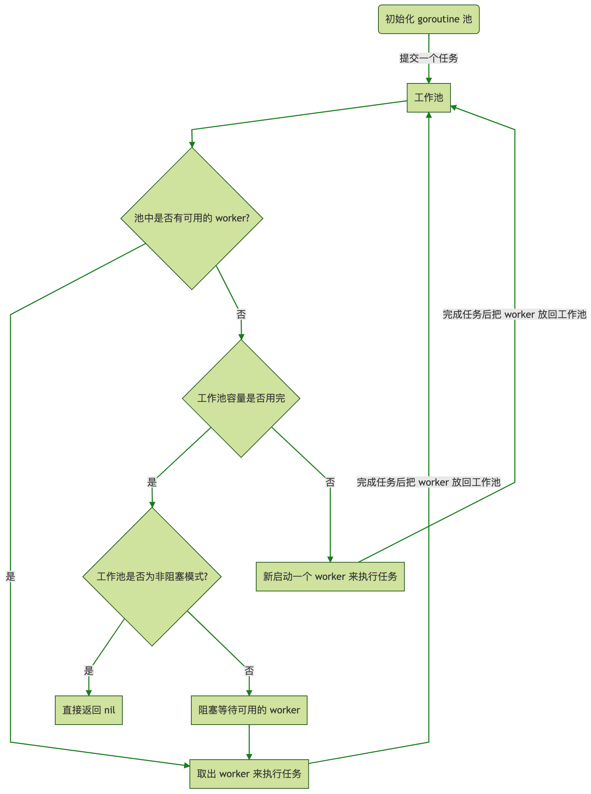
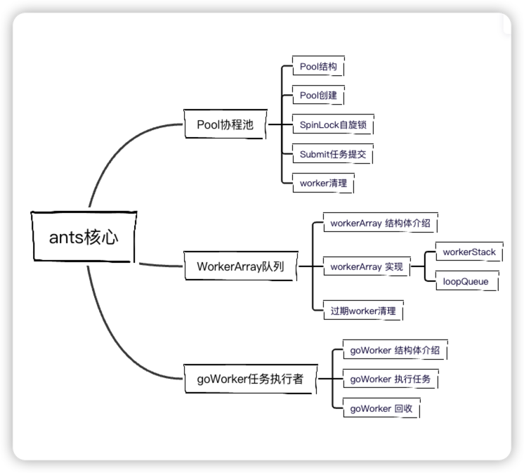

# 「死磕源码系列之ants协程池」高性能协程池ants源码剖析

[toc]

## 1、简介

### ants是什么

`ants`是一个高性能的 goroutine 池，实现了对大规模 goroutine 的调度管理、goroutine 复用，允许使用者在开发并发程序的时候限制 goroutine 数量，复用资源，达到更高效执行任务的效果。

### 功能特点

- 自动调度海量的 goroutines，复用 goroutines
- 定期清理过期的 goroutines，进一步节省资源
- 提供了大量有用的接口：任务提交、获取运行中的 goroutine 数量、动态调整 Pool 大小、释放 Pool、重启 Pool
- 优雅处理 panic，防止程序崩溃
- 资源复用，极大节省内存使用量；在大规模批量并发任务场景下比原生 goroutine 并发具有更高的性能
- 非阻塞机制

### 核心流程



### ants核心概念



- Pool ：协程池
- WorkerArray：Pool池中的worker队列，存放所有的goWorker
- goWorker：运行任务的实际执行者，它启动一个 goroutine 来接受任务并执行函数调用。


## 2、Pool协程池

### Pool结构

> Ants 提供了两种Pool结构：Pool和PoolWithFunc ；但两者逻辑大致一样，本文着重介绍Pool的结构

```go
	// Pool accepts the tasks from client, it limits the total of goroutines to a given number by recycling goroutines.
type Pool struct {
	// capacity of the pool, a negative value means that the capacity of pool is limitless, an infinite pool is used to
	// avoid potential issue of endless blocking caused by nested usage of a pool: submitting a task to pool
	// which submits a new task to the same pool.
  // 协程池的容量
	capacity int32

	// running is the number of the currently running goroutines.
  // 正在运行的goroutines的数量
	running int32

	// lock for protecting the worker queue.
  // 锁，自旋锁，保护队列
	lock sync.Locker

	// workers is a slice that store the available workers.
  // 存放池中所有的worker,workerArray包含可用workers队列和过期workers队列，只会从可用workers队列中取可用worker
	workers workerArray

	// state is used to notice the pool to closed itself.
  // 记录池子的状态 （关闭、开启）
	state int32

	// cond for waiting to get an idle worker.
  // 条件变量
	cond *sync.Cond

	// workerCache speeds up the obtainment of a usable worker in function:retrieveWorker.
  // worker 对象池
	workerCache sync.Pool

	// waiting is the number of goroutines already been blocked on pool.Submit(), protected by pool.lock
  //阻塞等待的任务量
	waiting int32
	// 清道夫，定时清理workerarray 队列中过期的worker
	purgeDone int32
	stopPurge context.CancelFunc
	// 定时器 更新pool中now的字段
	ticktockDone int32
	stopTicktock context.CancelFunc

	now atomic.Value
	// 需要自定义加载的配置
	options *Options
}
```

### Pool创建

```go
// NewPool generates an instance of ants pool.
func NewPool(size int, options ...Option) (*Pool, error) {
	opts := loadOptions(options...) // 加载自定义的options中的配置

	if size <= 0 {
		size = -1
	}

	if !opts.DisablePurge {// 当 DisablePurge 为 true 时，worker 不会被清除并且是驻留的。
		if expiry := opts.ExpiryDuration; expiry < 0 {
			return nil, ErrInvalidPoolExpiry
		} else if expiry == 0 {
			opts.ExpiryDuration = DefaultCleanIntervalTime // 默认间隔时间1s
		}
	}

	if opts.Logger == nil {
		opts.Logger = defaultLogger
	}

	p := &Pool{
		capacity: int32(size),
		lock:     syncx.NewSpinLock(),//自旋锁
		options:  opts,
	}
	p.workerCache.New = func() interface{} { //sync.pool 初始化
		return &goWorker{
			pool: p,
			task: make(chan func(), workerChanCap),
		}
	}
	if p.options.PreAlloc {
		if size == -1 {
			return nil, ErrInvalidPreAllocSize
		}
		p.workers = newWorkerArray(loopQueueType, size) //循环队列
	} else {
		p.workers = newWorkerArray(stackType, 0) //数组
	}

	p.cond = sync.NewCond(p.lock) // sync.cond初始化

	p.goPurge()
	p.goTicktock()

	return p, nil
}

```

### 自旋锁SpinLock(重点)

> 思考：如何设计一种自旋锁，设计自旋锁时需要注意什么？

spinLock是基于CAS机制和指数退避算法实现的一种自旋锁

```go
package sync

import (
	"runtime"
	"sync"
	"sync/atomic"
)

type spinLock uint32 // 实现sync.Locker接口

const maxBackoff = 16 //最大的回避次数

func (sl *spinLock) Lock() {
	backoff := 1
  // 基于CAS机制，尝试获取锁，且使用指数退避算法来提供获取锁的成功率
	for !atomic.CompareAndSwapUint32((*uint32)(sl), 0, 1) {
		// Leverage the exponential backoff algorithm, see https://en.wikipedia.org/wiki/Exponential_backoff.
		for i := 0; i < backoff; i++ {
     //runtime.Gosched()函数功能：使当前goroutine让出CPU时间片（“回避”），让其他的goroutine获得执行的机会。当前的goroutine会在未来的某个时间点继续运行。
    //注意：当一个goroutine发生阻塞，Go会自动地把与该goroutine处于同一系统线程的其他goroutines转移到另一个系统线程上去，以使这些goroutines不阻塞（从GMP模型角度来说，就是当与P绑定的M发生阻塞，P就与其解绑，然后与另一个空闲的M进行绑定 或者 去创建一个M进行绑定）。
			runtime.Gosched()
		}
		if backoff < maxBackoff {
			backoff <<= 1
		}
	}
}

func (sl *spinLock) Unlock() {
  //原子操作，并发安全
	atomic.StoreUint32((*uint32)(sl), 0)
}

// NewSpinLock instantiates a spin-lock.
func NewSpinLock() sync.Locker {
	return new(spinLock)
}

```

sync.Locker

> 设计锁时必须实现该接口中的方法

```go
// A Locker represents an object that can be locked and unlocked.
type Locker interface {
	Lock()
	Unlock()
}
```

**关键知识点**

- sync.Locker接口
- 指数退避算法
- atomic 原子包中的方法了解
- runtime.Gosched()


## 3、任务执行

### goWorker的结构

```go
// goWorker is the actual executor who runs the tasks,
// it starts a goroutine that accepts tasks and
// performs function calls.
//goWorker 是运行任务的实际执行者，它启动一个 goroutine 来接受任务并执行函数调用。
type goWorker struct {
	// pool who owns this worker.
	pool *Pool // 拥有worker的协议池

	// task is a job should be done.
	task chan func() // 需要执行的任务，注意：该chan 可能是缓存区或者非缓存区，如果是多核的话，缓存区的大小是1

	// recycleTime will be updated when putting a worker back into queue.
	recycleTime time.Time // 回收时间
}
```

##### goWoker的初始化

> goWorker 是sync.pool 对象池创建的；初始化在Pool创建时

```
p.workerCache.New = func() interface{} {
		return &goWorker{
			pool: p,
			task: make(chan func(), workerChanCap),
		}
	}
```

##### workerChanCap的值

```go
// workerChanCap determines whether the channel of a worker should be a buffered channel
	// to get the best performance. Inspired by fasthttp at
	// https://github.com/valyala/fasthttp/blob/master/workerpool.go#L139
	workerChanCap = func() int {
		// Use blocking channel if GOMAXPROCS=1.
		// This switches context from sender to receiver immediately,
		// which results in higher performance (under go1.5 at least).
		if runtime.GOMAXPROCS(0) == 1 {
			return 0
		}

		// Use non-blocking workerChan if GOMAXPROCS>1,
		// since otherwise the sender might be dragged down if the receiver is CPU-bound.
		return 1
	}()
```


### Task 任务提交

```go
func (p *Pool) Submit(task func()) error {
	if p.IsClosed() { // 前置检查 协程池是否关闭
		return ErrPoolClosed
	}
	var w *goWorker
	if w = p.retrieveWorker(); w == nil { //获取一个可用的worker取执行任务
		return ErrPoolOverload
	}
	w.task <- task
	return nil
}
```

##### retrieveWorker （可用worker获取）

```go
// retrieveWorker returns an available worker to run the tasks.
func (p *Pool) retrieveWorker() (w *goWorker) {
	spawnWorker := func() { // 使用sync.pool 创建worker
		w = p.workerCache.Get().(*goWorker)
		w.run()
	}

	p.lock.Lock() // 自旋锁 加锁

	w = p.workers.detach() // 尝试从worker池子中获取可用的worker，注：任务执行完后，会回收worker 以便下次使用
	if w != nil { // first try to fetch the worker from the queue  获取到返回
		p.lock.Unlock()
	} else if capacity := p.Cap(); capacity == -1 || capacity > p.Running() { // 判断正在运行的worker 是否超过 pool协程词设置的容量大小，注 capacity=-1 表示池子容量无限大
		// if the worker queue is empty and we don't run out of the pool capacity,
		// then just spawn a new worker goroutine.
		p.lock.Unlock()
		spawnWorker() // 创建worker
	} else { // otherwise, we'll have to keep them blocked and wait for at least one worker to be put back into pool.
		if p.options.Nonblocking { // 判断协程池是否 是非阻塞模式 ，如果是非阻塞模式下就直接返回
			p.lock.Unlock()
			return
		}
	retry: // 阻塞模式下的逻辑
    // 判断阻塞的任务数量是否超过了设置的最大阈值，如果超过直接返回
		if p.options.MaxBlockingTasks != 0 && p.Waiting() >= p.options.MaxBlockingTasks {
			p.lock.Unlock()
			return
		}
		p.addWaiting(1) // 阻塞任务数量加1
		p.cond.Wait() // block and wait for an available worker
		p.addWaiting(-1) // 获取到可用的worker后，阻塞数量减一

		if p.IsClosed() { // check pool池是否关闭
			p.lock.Unlock()
			return
		}

		var nw int
		if nw = p.Running(); nw == 0 { // 如果正在执行的worker数量为0时，需要重新创建woker
			p.lock.Unlock()
			spawnWorker()
			return
		}
		if w = p.workers.detach(); w == nil { //从workerArray中获取可用的worker
			if nw < p.Cap() { // 获取不到，判断正在运行的goroutines的数量是否超过协层池的容量，没有就创建
				p.lock.Unlock()
				spawnWorker()
				return
			}
			goto retry // goto 重试阻塞模式下获取可用worker的逻辑
		}
		p.lock.Unlock()
	}
	return
}

```

### WorkerArray 工作池的结构

```go
type workerArray interface {
	len() int // 长度
	isEmpty() bool // 是否为空
	insert(worker *goWorker) error // 插入
	detach() *goWorker // 从WorkerArray获取可用的worker
	retrieveExpiry(duration time.Duration) []*goWorker  //清道夫调用pool.worker中的此方法来清理pool.workers中的过期worker
	reset() // 重置，清空WorkerArray中所有的Worker
}
```

workerArray 接口的实现`workerStack` 和`loopQueue`


### 任务执行

```go
// run starts a goroutine to repeat the process
// that performs the function calls.
func (w *goWorker) run() {
   w.pool.addRunning(1) // pool的running 加 一
   go func() {
      defer func() {
         w.pool.addRunning(-1)
         w.pool.workerCache.Put(w)
         if p := recover(); p != nil {
            if ph := w.pool.options.PanicHandler; ph != nil {
               ph(p)
            } else {
               w.pool.options.Logger.Printf("worker exits from a panic: %v\n", p)
               var buf [4096]byte
               n := runtime.Stack(buf[:], false)
               w.pool.options.Logger.Printf("worker exits from panic: %s\n", string(buf[:n]))
            }
         }
         // Call Signal() here in case there are goroutines waiting for available workers.
         w.pool.cond.Signal() 
      }()

      for f := range w.task {
         if f == nil {
            return
         }
         f() // 任务执行
         if ok := w.pool.revertWorker(w); !ok { // 回收woker
            return
         }
      }
   }()
}
```

`revertWorker`worker回收

> 逻辑简单：1、往workerArray 队列中插入；2、通知正在阻塞获取worker的goroutines

```go
// revertWorker puts a worker back into free pool, recycling the goroutines.
func (p *Pool) revertWorker(worker *goWorker) bool {
	if capacity := p.Cap(); (capacity > 0 && p.Running() > capacity) || p.IsClosed() {
		p.cond.Broadcast()
		return false
	}
	worker.recycleTime = p.nowTime()
	p.lock.Lock()

	// To avoid memory leaks, add a double check in the lock scope.
	// Issue: https://github.com/panjf2000/ants/issues/113
	if p.IsClosed() {
		p.lock.Unlock()
		return false
	}

	err := p.workers.insert(worker)
	if err != nil {
		p.lock.Unlock()
		return false
	}

	// Notify the invoker stuck in 'retrieveWorker()' of there is an available worker in the worker queue.
	p.cond.Signal()
	p.lock.Unlock()
	return true
}

```

#### 定时清理过期的worker

```go
func (p *Pool) goPurge() {
	if p.options.DisablePurge {
		return
	}

	// Start a goroutine to clean up expired workers periodically.
	var ctx context.Context
	ctx, p.stopPurge = context.WithCancel(context.Background())
	go p.purgeStaleWorkers(ctx)
}

// purgeStaleWorkers clears stale workers periodically, it runs in an individual goroutine, as a scavenger.
func (p *Pool) purgeStaleWorkers(ctx context.Context) {
	ticker := time.NewTicker(p.options.ExpiryDuration)

	defer func() {
		ticker.Stop()
		atomic.StoreInt32(&p.purgeDone, 1)
	}()

	for {
		select {
		case <-ctx.Done():
			return
		case <-ticker.C:
		}

		if p.IsClosed() {
			break
		}

		p.lock.Lock()
		expiredWorkers := p.workers.retrieveExpiry(p.options.ExpiryDuration)
		p.lock.Unlock()

		// Notify obsolete workers to stop.
		// This notification must be outside the p.lock, since w.task
		// may be blocking and may consume a lot of time if many workers
		// are located on non-local CPUs.
		for i := range expiredWorkers {
			expiredWorkers[i].task <- nil
			expiredWorkers[i] = nil
		}

		// There might be a situation where all workers have been cleaned up(no worker is running),
		// or another case where the pool capacity has been Tuned up,
		// while some invokers still get stuck in "p.cond.Wait()",
		// then it ought to wake all those invokers.
		if p.Running() == 0 || (p.Waiting() > 0 && p.Free() > 0) {
			p.cond.Broadcast()
		}
	}
}

```

## 4、总结

至此，ants源码简单分析完毕；整体框架结构不太复杂，阅读起来也很轻松；但源码中有很多知识点需要我们花些时间去理解，比如 自旋锁的设计、sync.cond 条件变量 、sync.pool 对象池，原子操作，channel通信等，建议大家多多阅读。

## 5、参考资料

[指数退避算法](https://en.wikipedia.org/wiki/Exponential_backoff)
